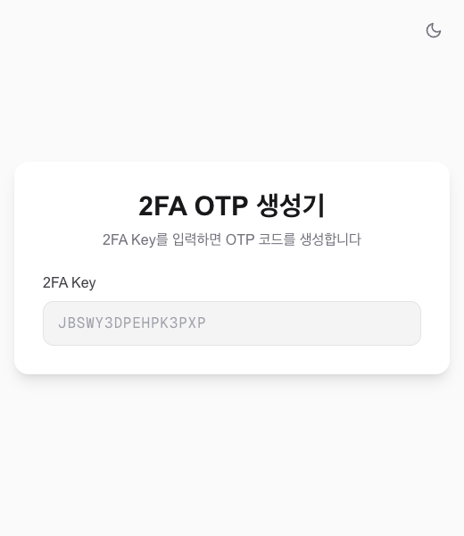
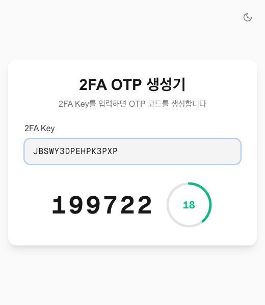
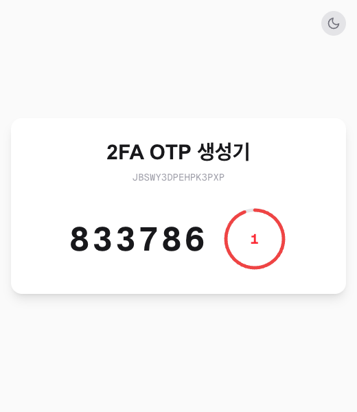
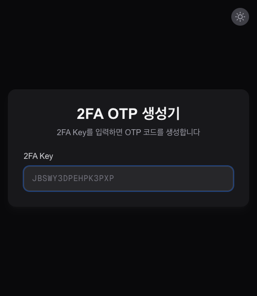
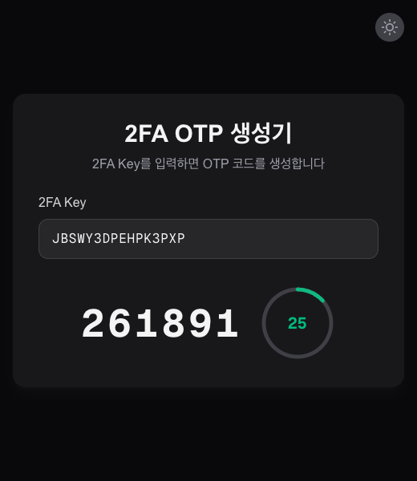

<div align="center">

# 2FA OTP 생성기

[](https://2fa.ai9dok.com)
[](https://nextjs.org)
[](https://react.dev)
[](https://tailwindcss.com)
[](LICENSE)

2FA Secret Key(Base32)를 입력하면 실시간으로 TOTP 코드를 생성하는 웹 앱

[https://2fa.ai9dok.com](https://2fa.ai9dok.com)

</div>

---

## 스크린샷

### 라이트 모드

| 홈 화면 | OTP 생성 | 고정 키 URL |
|:---:|:---:|:---:|
|  |  |  |

### 다크 모드

| 홈 화면 | OTP 생성 | 고정 키 URL |
|:---:|:---:|:---:|
|  |  |  |

## 기능

- **OTP 코드 생성** — Base32 Secret Key 입력 시 6자리 TOTP 코드 실시간 생성
- **카운트다운 타이머** — 30초 주기 원형 프로그레스 타이머, 5초 이하 시 빨간색 경고
- **고정 키 URL** — `https://2fa.ai9dok.com/{your-secret-key}` 접속 시 해당 키의 OTP 즉시 표시
- **클립보드 복사** — OTP 코드 클릭으로 즉시 복사
- **라이트/다크 모드** — 시스템 설정 연동 및 수동 전환 지원
- **입력 자동 정리** — 공백, 하이픈 자동 제거 및 대문자 변환
- **Base32 유효성 검사** — 잘못된 키 입력 시 한국어 에러 메시지 표시
- **클라이언트 전용** — 모든 연산은 브라우저에서 처리, 키는 서버로 전송되지 않음

## 기술 스택

| 구분 | 기술 |
|---|---|
| 프레임워크 | [Next.js](https://nextjs.org) 16 (App Router) |
| UI | [React](https://react.dev) 19 |
| 스타일링 | [Tailwind CSS](https://tailwindcss.com) 4 |
| OTP 생성 | [OTPAuth](https://github.com/hectorm/otpauth) (RFC 6238) |
| 배포 | [Vercel](https://vercel.com) |

## 사용법

### 웹에서 사용

1. [2fa.ai9dok.com](https://2fa.ai9dok.com) 접속
2. 2FA Key(Base32) 입력
3. 생성된 OTP 코드 클릭하여 복사

### 고정 키 URL

특정 키의 OTP를 바로 확인하려면 URL에 키를 포함하여 접속합니다.

```
https://2fa.ai9dok.com/JBSWY3DPEHPK3PXP
```

## 로컬 개발

```bash
git clone https://github.com/yeonkyun/2fa-otp-generator.git
cd 2fa-otp-generator
npm install
npm run dev
```

[http://localhost:3000](http://localhost:3000)에서 확인할 수 있습니다.

## 프로젝트 구조

```
src/
├── app/
│   ├── layout.tsx          # 루트 레이아웃 (다크모드 FOUC 방지)
│   ├── page.tsx            # 메인 페이지
│   ├── [key]/page.tsx      # 고정 키 동적 라우트
│   └── globals.css         # Tailwind CSS 설정
├── components/
│   ├── SecretKeyInput.tsx   # 키 입력 컴포넌트
│   ├── OtpDisplay.tsx       # OTP 코드 표시 및 복사
│   ├── CountdownTimer.tsx   # 원형 카운트다운 타이머
│   └── ThemeToggle.tsx      # 다크모드 토글
└── lib/
    ├── otp.ts              # TOTP 생성 및 Base32 검증
    └── types.ts            # 공통 타입 정의
```

## 라이선스

MIT
